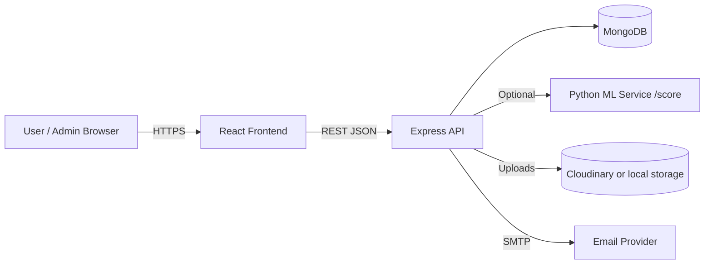
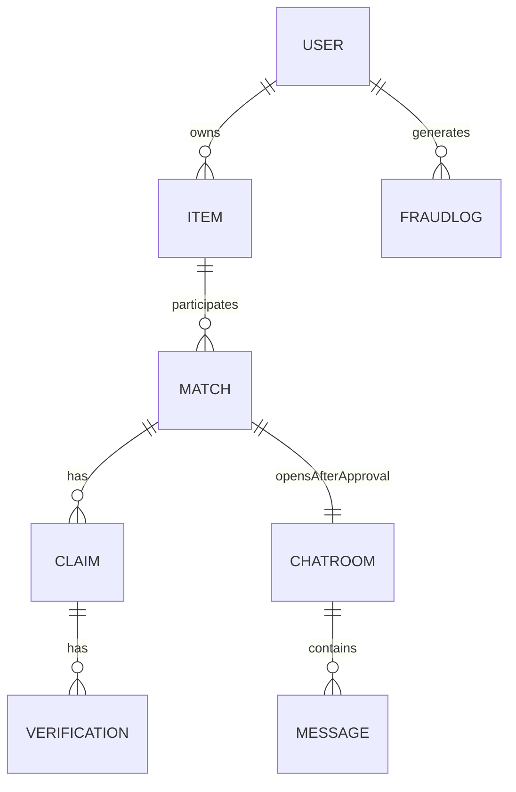

# BackToYou — Product Requirements Document (PRD)

## 1. Executive Summary

**BackToYou** is a college lost-and-found platform that helps people recover lost belongings by safely connecting the person who **lost** an item with the person who **found** it.

What makes it different from typical “posting boards”:

- **Explainable matching** suggests candidate matches (never auto-returns).
- **Private ownership verification** blocks false claims.
- **Human-in-the-loop admin approval** is mandatory for every return.
- **Secure communication** is enabled *only after approval* via a chat room.

**Target users**
- Students and staff on campus (primary)
- Admin desk / security office (moderation & approvals)

**Key value**
- Faster recovery, less fraud, clear accountability, and a product experience that feels trustworthy and interview-ready.

---

## 2. Problem Statement

Lost items on campus are common. Existing solutions are typically:

- Fragmented (WhatsApp groups, posters, informal desk logs)
- Not searchable or structured
- Vulnerable to fraud (“I claim it’s mine”)
- Unsafe (direct communication too early)
- Poor auditability (no history of who decided what)

BackToYou centralizes reporting and matching while reducing incorrect handoffs through verification + admin oversight.

---

## 3. Goals

1. **Recover lost items faster**
   - Structured item reporting
   - Candidate match suggestions

2. **Reduce fraud / false claims**
   - Limited public item details
   - Private K-out-of-N verification
   - Suspicion scoring, rate limiting, blocking

3. **Enable verified communication**
   - Chat opens only after admin approval
   - Only the two involved users can message
   - Admin can read for moderation

4. **Explainability and trust**
   - Match explanation visible to admins
   - Safe, limited explanation to the lost-item owner
   - No scoring visibility to the found-item reporter

---

## 4. Non-Goals (Intentional Exclusions)

- **No auto-return** (system never completes a return decision automatically)
- **No deep learning / CNN image recognition** (classical TF‑IDF + cosine + rules only)
- **No open communication pre-approval** (prevents harassment & social engineering)
- **No dataset requirement / labeling pipeline** (live corpus only)

---

## 5. User Roles & Permissions

### USER — Lost Item Owner
Can:
- Report lost items
- See candidate matches for their lost items
- See **confidence + short reason** (not raw scoring)
- Submit claims & verification answers
- Chat with the finder **only after admin approval**

Cannot:
- See internal scoring breakdown values
- See other users’ matches/items

### USER — Found Item Reporter
Can:
- Report found items
- Wait for claims
- Chat **only after admin approval**

Cannot:
- See match score/explanation (prevents gaming + social engineering)

### ADMIN (single admin account)
Can:
- Review all reports and claims
- See full match breakdown (text + rule scores + final)
- Approve/reject claims
- View chats for moderation

Cannot:
- Message in chats (admin is view-only for moderation)

---

## 6. Key Features (What / How / Why)

### 6.1 Authentication & RBAC
**What:** User auth + admin auth, with server-side RBAC enforcement.  
**How:** JWT + DB-loaded user context on each request. Admin login requires a secret key.  
**Why:** Prevent privilege escalation and keep role checks current (not stale token roles).

### 6.2 Lost/Found Reporting
**What:** Submit structured reports.  
**How:** Items stored in MongoDB with public fields + optional private fields.  
**Why:** Enables searchable and matchable entries.

### 6.3 Candidate Matching (Explainable ML)
**What:** Suggest candidate pairs; never decides ownership.  
**How:** TF‑IDF + cosine text similarity + rule-based scoring; final score:

`final = 0.6 * textSimilarity + 0.4 * ruleScore`

Rule score is the average of:
- `categoryScore`
- `colorScore`
- `locationScore`
- `dateScore`

**Why:** Classical and explainable; no labeled dataset required; easy to justify in interviews.

### 6.4 Ownership Verification (K-of-N)
**What:** Private questions must match the lost-item’s private details.  
**How:** Build prompts from `privateDetails`, evaluate via soft matching, require `k = ceil(0.7*N)` correct.  
**Why:** Blocks false claims while keeping sensitive details hidden.

### 6.5 Fraud & Abuse Controls
**What:** Suspicion/trust scoring, rate limiting, blocking.  
**How:** Claims per day limit, vague-answer detection, failed-claim penalties, audit logging.  
**Why:** Real-world systems need guardrails; shows production thinking.

### 6.6 Admin Approval
**What:** Admin approves/rejects claims.  
**How:** Admin dashboard shows match + explanation + verification answers; approval marks items as RETURNED.  
**Why:** Mandatory human oversight prevents wrong returns.

### 6.7 Secure Chat (Post-Approval Only)
**What:** A chat room for the two involved users is created only after approval.  
**How:** On claim approval, create `ChatRoom(matchId, lostUserId, foundUserId)`. Only participants can send messages. Admin can read.  
**Why:** Prevents harassment and social engineering; enables coordination after verified decision.

### 6.8 Notifications
**What:** Users get a pop-up when a chat becomes available.  
**How:** Frontend polls chat rooms and shows a one-time toast per room.  
**Why:** Lightweight and reliable without WebSockets; good dev UX.

---

## 7. Complete User Flows

### 7.1 Lost Item Flow
1. User registers/logs in
2. Reports a LOST item (optionally includes private details)
3. System generates candidate matches (ML service or local fallback)
4. User reviews candidate matches and submits a claim
5. User answers verification questions
6. Admin reviews and approves/rejects
7. If approved: items marked RETURNED + chat enabled

### 7.2 Found Item Flow
1. Finder registers/logs in
2. Reports a FOUND item
3. Waits for verification and admin decision
4. If approved: chat enabled for coordination

### 7.3 Match Verification Flow
1. Candidate match is suggested
2. Only the lost-item owner can claim
3. Verification prompts are generated from private details
4. Claim is stored with verification attempt breakdown
5. Admin reviews result and makes final decision

### 7.4 Communication Flow (Post Approval)
1. Admin approves claim
2. `ChatRoom` created for match participants
3. Both users see “chat ready” toast
4. Users exchange messages (admin can view)

---

## 8. System Architecture

### Components
- **Frontend:** React + Tailwind + Zustand + TanStack Query
- **Backend:** Express API + JWT + RBAC + matching orchestration
- **Database:** MongoDB (Mongoose)
- **Matching:** Python FastAPI scoring service (optional) + Node fallback scorer
- **Storage:** Cloudinary (optional) or local file system
- **Email:** Nodemailer (optional; logs if SMTP not configured)

### Architecture diagram (Mermaid)

---

## 9. Database Design (High-Level)

Collections:
- `users`
- `items`
- `matches`
- `claims`
- `verifications`
- `fraudlogs`
- `chatrooms`
- `messages`

ER diagram (Mermaid):

---

## 10. Matching Algorithm (Explainable, Classical)

Inputs (public fields only):
- title, description, category, color, location, event date

Steps:
1. Normalize text
2. TF‑IDF vectorization over live corpus
3. Cosine similarity vs candidates
4. Rule component scores:
   - category match
   - color match
   - location overlap
   - date proximity
5. Aggregate:
   - `ruleScore = avg(components)`
   - `finalScore = 0.6*text + 0.4*rules`

Outputs:
- Confidence label (High/Medium/Low)
- ConfidenceLevel gating (HIGH_CONFIDENCE/AMBIGUOUS) — **never implies auto-return**

---

## 11. Security Considerations

- **Auth:** JWT bearer tokens
- **RBAC:** DB-backed role checks; single-admin enforced via DB constraint
- **Visibility constraints:** Found reporters don’t see scoring; lost owners see only short reasons
- **Fraud controls:** rate limiting, vague answers, suspicion scoring + blocking
- **Secure messaging:** chat created only after approval; only participants can send; admin can view for moderation

---

## 12. Deployment Architecture (Recommended)

- Frontend: Vercel / Netlify
- Backend: Render / Fly.io / Railway
- DB: MongoDB Atlas
- ML service: Render (Python web service) or disable and rely on backend fallback scorer (`ML_MODE=local`)
- Storage: Cloudinary

---

## 13. Scalability Considerations

- MongoDB indexes on hot query fields (items, matches, claims, messages)
- Background job queue for email + heavy matching
- Cache match results per item to avoid repeated scoring
- Move matching to async worker if item volumes grow
- WebSockets can replace polling for chat (optional)

---

## 14. Future Improvements

- WebSocket chat (Socket.io) for true realtime
- Better location modeling (building-level proximity)
- Admin “merge duplicate reports” tooling
- Stronger fraud detection (device fingerprinting, anomaly detection)
- Optional OCR/metadata extraction from uploaded images (still explainable)
