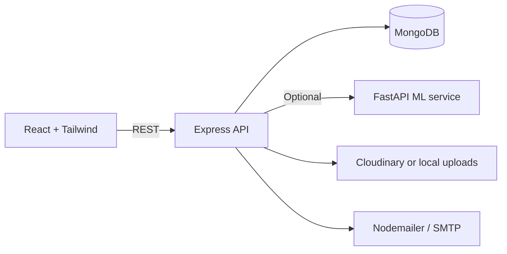

# BackToYou — Interview-Ready Technical README

This document is optimized for **technical interviews**: it explains the *what*, *how*, and *why* behind the architecture and business rules.

---

## 1) 30-second explanation

BackToYou is a campus lost-and-found platform. Users report lost/found items, the system suggests candidate matches using **explainable classical ML** (TF‑IDF + cosine + rules), the lost-item owner proves ownership via **private verification**, and a **single admin** approves or rejects the return. Only after approval, a **secure chat room** opens for the two users to coordinate pickup.

---

## 2) 2-minute explanation

The core challenge is **trust**: you want fast matching but you must avoid fraud and unsafe coordination. So the system splits the workflow:

1. **Matching generates candidates** (public fields only).
2. **Verification proves ownership** (private fields only).
3. **Admin approves truth** (human-in-the-loop).

Explainability matters: the admin sees a full numeric breakdown of how a match was scored, while users see only what’s safe for their role (lost owners see confidence + a short reason; found reporters see no score).

After approval, the system creates a chat room for exactly those two users. Chat is gated by claim approval and strict RBAC.

---

## 3) System architecture



**Why this architecture**
- Keeps deployment simple (MERN).
- Matching can be a separate service (Python) but the backend has a local fallback scorer to keep the system functional.
- Strict RBAC keeps security decisions server-side.

---

## 4) Tech stack (What / Why / How)

### Frontend
- **React + Vite**: fast dev loop and production builds.
- **Tailwind CSS**: consistent design system and speed.
- **Zustand**: minimal auth state management.
- **TanStack Query**: reliable API caching + polling (used for chat and admin updates).
- **Framer Motion**: subtle animations for a polished UX.

### Backend
- **Node.js + Express**: pragmatic REST API.
- **Mongoose (MongoDB)**: flexible schemas + indexing.
- **JWT**: stateless auth.
- **Zod**: request validation at the edges.

### ML (Explainable)
Two interchangeable implementations:
- **Python FastAPI** (`ml-service/app/main.py`) for TF‑IDF + cosine + rule scoring.
- **Node local fallback** (`backend/src/ml/localScorer.ts`) using `natural` TF‑IDF and the same rule formula.

### Storage + Email
- **Cloudinary** optional (`CLOUDINARY_URL`) or local uploads.
- **Nodemailer** optional SMTP; logs email in dev if SMTP not set.

---

## 5) Business logic “contracts” (rules that must never break)

1. **Never auto-return items**
   - Matching produces candidates only.
   - Only admin decision can mark items `RETURNED`.

2. **Role-based visibility (anti-gaming)**
   - Lost owner: confidence + short reason (no raw scores)
   - Found reporter: no score/explanation
   - Admin: full numeric explanation

3. **Chat only after admin approval**
   - `ChatRoom` exists only for approved matches.
   - Only the two users can message; admin can view.

4. **Single admin**
   - Enforced with a DB unique partial index on `users.adminSingleton=true`.
   - Admin-only routes require the primary admin record.

---

## 6) Folder structure (why it’s organized this way)

```
backend/src/
  config/           env parsing
  db/               mongoose connection
  http/             errors + middleware
  models/           mongoose schemas
  routes/           REST endpoints
  matching/         candidate generation orchestration
  ml/               ML client + local scorer
  verification/     K-of-N ownership checks
  uploads/          Cloudinary/local storage
  scripts/          seed + smoke tests

frontend/src/
  components/       reusable UI system
  pages/            route-level views
  lib/              API client
  store/            auth state
```

This structure keeps concerns separated and interview-friendly: routing, persistence, ML, and verification logic are easy to point to.

---

## 7) Database design (collections)

### `users`
Key fields:
- `role`: USER / ADMIN
- `adminSingleton`: enforces single admin
- `trustScore`, `suspicionScore`, `flags.isBlocked`
Indexes:
- email unique
- partial unique index on `adminSingleton=true`

### `items`
- `type`: LOST / FOUND
- `status`: ACTIVE / RETURNED / ARCHIVED
- `publicDetails` and `privateDetails`
Indexes: `(type, status, createdAt)`, text index on title

### `matches`
Stores the candidate pairing and explainability:
- `scores`: `{ textSimilarity, categoryScore, colorScore, locationScore, dateScore, ruleScore, finalScore }`
- `confidence`: High/Medium/Low
- `confidenceLevel`: HIGH_CONFIDENCE/AMBIGUOUS

### `claims` + `verifications`
Claim lifecycle:
- `PENDING -> APPROVED/REJECTED`
Verification stores K-of-N breakdown and answers (admin view).

### `chatrooms` + `messages`
Created only after approval:
- Room unique by `matchId`
- Messages are append-only and indexed by room + time.

---

## 8) Matching algorithm (deep but explainable)

**Inputs:** public fields only  
**Text score:** TF‑IDF vectors + cosine similarity  
**Rule score components:**
- category match (1 or 0)
- color match (1 or 0 with simple contains check)
- location overlap (token Jaccard)
- date proximity (`1 - daysApart/14`)

**Aggregation**
- `ruleScore = avg(components)`
- `finalScore = 0.6 * textSimilarity + 0.4 * ruleScore`

Why: deterministic, transparent, and doesn’t require labeled data.

---

## 9) API map (key endpoints)

Auth:
- `POST /api/auth/register` (USER)
- `POST /api/auth/login` (USER only; admins are blocked here)
- `POST /api/auth/admin/login` (ADMIN + secret key)
- `GET /api/auth/me`

Items:
- `POST /api/items`
- `GET /api/items?mine=1`
- `GET /api/items/:id`
- `POST /api/items/:id/match`

Matches:
- `GET /api/matches?itemId=...`
- `GET /api/matches/:id` (role-based response)
- `GET /api/matches/:id/claim-prompts`

Claims:
- `POST /api/claims`
- `GET /api/claims?mine=1`

Admin:
- `GET /api/admin/items`
- `GET /api/admin/claims`
- `POST /api/admin/claims/:id/decision`
- `GET /api/admin/matches/:id/explanation`

Chat:
- `POST /api/chat/start/:matchId`
- `GET /api/chat/mine`
- `GET /api/chat/:chatRoomId`
- `POST /api/chat/:chatRoomId/message`

---

## 10) Local development

Requirements:
- Node.js 20.x
- MongoDB (local `mongod` or Atlas)
- Python 3.10+ (optional, for ML service)

Start MongoDB:
- Local: start `mongod` on `127.0.0.1:27017`
- Atlas: set `MONGODB_URI` in `backend/.env`

Install:
`npm i`

Run:
`npm run dev`

Seed single admin:
`npm -C backend run seed:admin`

Smoke test (end-to-end):
`npm -C backend run smoke`

---

## 11) Common pitfalls

- If old data “disappears”, you likely changed `MONGODB_URI` to a different DB.
- Admin auth uses `/api/auth/admin/login` and requires `ADMIN_LOGIN_SECRET`.
- The Python ML service is optional; backend fallback keeps matching working.

---

## 12) Deep technical explanation (for senior interviewers)

**Design principle:** separate candidate generation from truth decisions.

- Candidate generation (ML) is intentionally allowed to be “wrong” sometimes because it does not return items.
- Verification (private details) + Admin approval ensures correctness.
- Visibility constraints prevent adversarial users from reverse-engineering scoring/verification behavior.
- Chat gating ensures safety and reduces social engineering before the system has confidence.

If I had more time, I would make matching async via a queue, replace chat polling with WebSockets, and add stronger abuse detection + admin tooling.

---

## 13) Deployment notes (Vercel + Render)

### Frontend (Vercel)
- Set `VITE_API_URL` to your Render backend URL.

### Backend (Render)
- Set `APP_ORIGIN` to your Vercel URL for CORS.
- Use MongoDB Atlas for `MONGODB_URI`.
- Admin auth uses `/api/auth/admin/login` and requires `ADMIN_LOGIN_SECRET`.

### ML service (optional)
Pick one:

1) **Deploy ML service on Render (Python web service)**
   - Root directory: `ml-service`
   - Build: `pip install -r requirements.txt`
   - Start: `uvicorn app.main:app --host 0.0.0.0 --port $PORT`
   - Set backend `ML_SERVICE_URL` to the ML service URL.

2) **No ML service (backend-only)**
   - Set `ML_MODE=local` on the backend.
